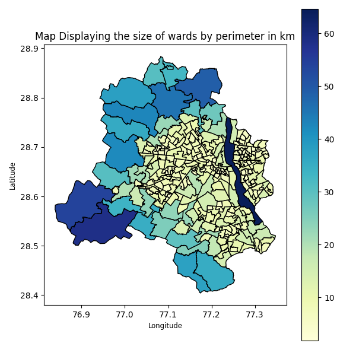

<div align="center">

# 📏 Ward Perimeter Map

**A branch of [Urban Mobility GIS](https://github.com/shreyanspeaking-arch/Urban-Mobility-GIS), a collection of Python programs that map and measure the wards of Indian cities.**

  

</div>

The perimeter of a ward is the length of its boundary. Set against its area, it shows how compact or how stretched and irregular each ward is.

## 📂 Programs in this branch

| # | Program | What it does |
|:-:|---|---|
| 1 | [**Ward Perimeter Map**](#1-ward-perimeter-map) | Perimeter of each ward in km, saved to Excel and shown on a map |

## ⚙️ Getting started

```bash
git clone -b Ward-Perimeter-Map --single-branch https://github.com/shreyanspeaking-arch/Urban-Mobility-GIS.git
cd Urban-Mobility-GIS
curl -LO https://github.com/shreyanspeaking-arch/Urban-Mobility-GIS/raw/Input-gpkg-files/delhi_wards.gpkg
pip install geopandas pandas matplotlib openpyxl
python ward_perimeter.py
```

Every program is interactive: it asks for its inputs one at a time in the terminal, then saves the results to an `.xlsx` file and shows a map. Input files for 8 cities are on the [Input gpkg files](https://github.com/shreyanspeaking-arch/Urban-Mobility-GIS/tree/Input-gpkg-files) branch.

---

## 1. Ward Perimeter Map

📄 **File:** [`ward_perimeter.py`](./ward_perimeter.py)

Computes the perimeter of every ward in a city from a ward-boundary file, saves the list of wards and their perimeters to Excel, and draws a choropleth map of the wards shaded by perimeter.

**How it works**

1. The user enters the name of a ward-boundary file, such as a `.gpkg` file from the [Input gpkg files](https://github.com/shreyanspeaking-arch/Urban-Mobility-GIS/tree/Input-gpkg-files) branch. If the file has no `WARD` column, the program lists its columns and asks which one holds the ward name or number; it does the same for the geometry column.
2. The ward shapes are projected to UTM zone 45N (`EPSG:32645`) so that they can be measured in metres, and the length of each ward's boundary is computed and converted to km.
3. The user enters a name for the output file (without `.xlsx`). The program saves the columns `WARD` and `Perimeter (in km)` to that Excel file, then projects the wards back to latitude and longitude and draws a map of the wards shaded by perimeter.

**🧪 Sample input and output**

| Input | Output |
|---|---|
| [`delhi_wards.gpkg`](https://github.com/shreyanspeaking-arch/Urban-Mobility-GIS/blob/Input-gpkg-files/delhi_wards.gpkg) | [`delhi.xlsx`](./delhi.xlsx)<br>[`delhi.png`](./delhi.png) |

**🗺️ Sample map**

<p align="center">
  
</p>

---

<div align="center"><sub>📚 <a href="https://github.com/shreyanspeaking-arch/Urban-Mobility-GIS">Back to all topics</a></sub></div>
