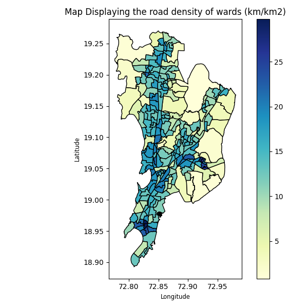

<div align="center">

# 🛣️ Ward Road Density

**A branch of [Urban Mobility GIS](https://github.com/shreyanspeaking-arch/Urban-Mobility-GIS), a collection of Python programs that map and measure the wards of Indian cities.**

  

</div>

Road density is the total length of roads in an area divided by the size of that area, in km of road per km². It shows how well each ward is served by its road network: dense, well-connected cores score high, while outskirts and large open or industrial wards score low.

## 📂 Programs in this branch

| # | Program | What it does |
|:-:|---|---|
| 1 | [**Road Density per Electoral Ward**](#1-road-density-per-electoral-ward) | Total length of drivable roads in each ward divided by its area (km/km²), with a map |

## ⚙️ Getting started

```bash
git clone -b Ward-Road-Density --single-branch https://github.com/shreyanspeaking-arch/Urban-Mobility-GIS.git
cd Urban-Mobility-GIS
curl -LO https://github.com/shreyanspeaking-arch/Urban-Mobility-GIS/raw/Input-gpkg-files/mumbai_electoral_wards_2017.gpkg
pip install geopandas osmnx pandas numpy matplotlib openpyxl
python Road_Density_per_Electoral_Ward.py
```

Every program is interactive: it asks for its inputs one at a time in the terminal, then saves the results to an `.xlsx` file and shows a map. Input files for 8 cities are on the [Input gpkg files](https://github.com/shreyanspeaking-arch/Urban-Mobility-GIS/tree/Input-gpkg-files) branch. This program also needs an internet connection, because it downloads the road network from OpenStreetMap.

---

## 1. Road Density per Electoral Ward

📄 **File:** [`Road_Density_per_Electoral_Ward.py`](./Road_Density_per_Electoral_Ward.py)

Estimates the road density of every ward in a city, using the drivable road network from OpenStreetMap, saves the results to Excel, and draws a choropleth map of the wards shaded by road density.

**How it works**

1. The user enters the name of a ward-boundary file, such as a `.gpkg` file from the [Input gpkg files](https://github.com/shreyanspeaking-arch/Urban-Mobility-GIS/tree/Input-gpkg-files) branch. The program lists the file's columns and asks which one holds the ward name or number, then which one holds the ward shapes (enter `geometry`).
2. The drivable road network covering all the wards is downloaded from OpenStreetMap with `osmnx` and treated as undirected, so a two-way road is counted once.
3. The roads and the wards are projected to the local UTM zone, chosen automatically for the city. The roads are cut along the ward boundaries, and the lengths of the pieces inside each ward are added up to give the approximate total length of roads in that ward, in km.
4. The area of each ward is computed in km², and the road density is the total road length divided by the area.
5. The user enters a name for the output file (without `.xlsx`). The program saves each ward's road length, area and road density (km/km²) to that Excel file, then draws a map of the wards shaded by road density.

**🧪 Sample input and output**

| Input | Output |
|---|---|
| [`mumbai_electoral_wards_2017.gpkg`](https://github.com/shreyanspeaking-arch/Urban-Mobility-GIS/blob/Input-gpkg-files/mumbai_electoral_wards_2017.gpkg) | [`mumbai.xlsx`](./mumbai.xlsx)<br>[`mumbai.png`](./mumbai.png) |

**🗺️ Sample map**

<p align="center">
  
</p>

---

<div align="center"><sub>📚 <a href="https://github.com/shreyanspeaking-arch/Urban-Mobility-GIS">Back to all topics</a></sub></div>
